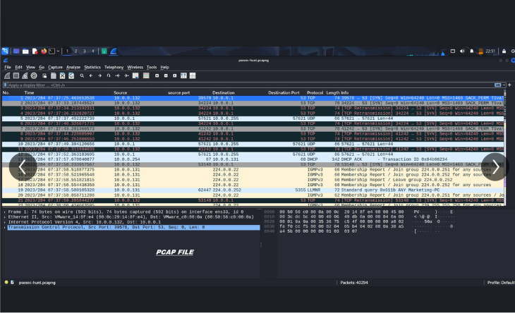
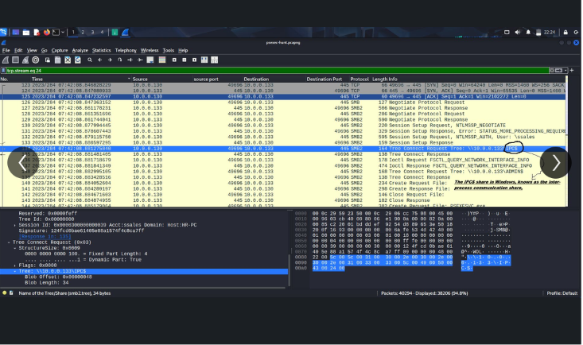
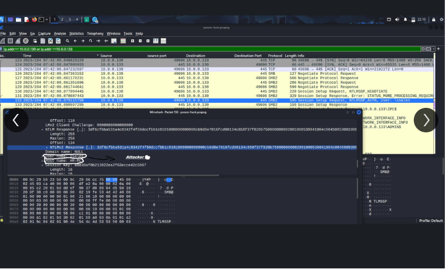
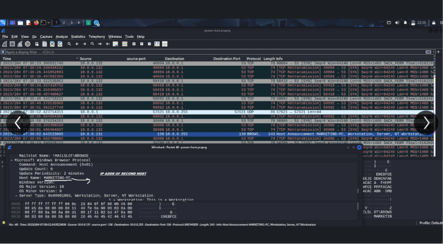
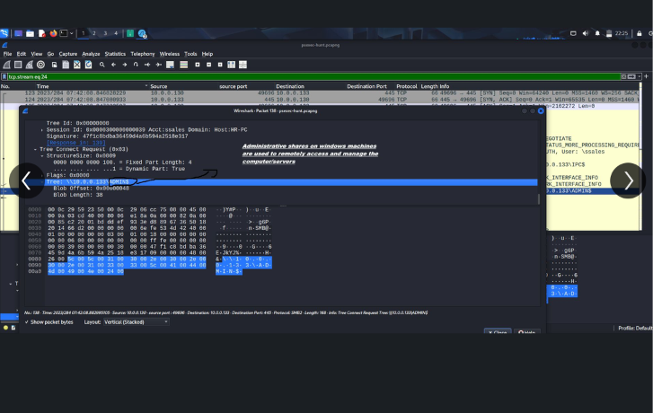
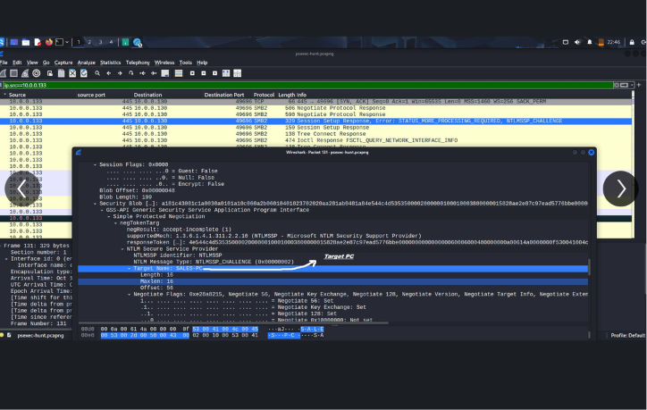
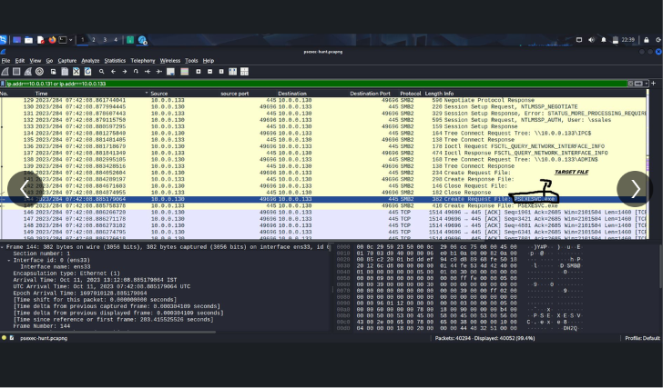

# 🕵️ PsExec Lateral Movement — Network Traffic Hunt

## 📋 Overview

A network forensics investigation into lateral movement using **PsExec**, one of the most
common tools attackers (and admins) use to remotely execute commands across a Windows
network. Working entirely from a packet capture (`psexec-hunt.pcapng`), this lab traces the
full SMB-based attack chain an attacker follows when using PsExec to move from one
compromised host to another — authentication, share access, file transfer, and remote
execution — all visible in raw network traffic if you know what to look for.

**Type:** Network Forensics / Threat Hunting
**Platform:** TryHackMe
**Tools:** Wireshark

---

## 1. 🌐 Initial Traffic Triage

Loaded the capture and got an overview of the traffic on the network — a mix of DNS,
DHCP, IGMP, and broadcast noise alongside the traffic of actual interest. Filtered down
past the background noise to focus on SMB and TCP traffic between the two hosts involved
in the incident.

## 2. 🔑 SMB Tree Connect Request — First Sign of Remote Access

Followed the TCP stream on the SMB session and found a **Tree Connect Request** to
`\\10.0.0.133\IPC$` from a session tied to account `sales` on host `HR-PC` — the IPC$
share is used for inter-process communication and is commonly the very first thing PsExec
touches when initiating a remote session, making this the earliest indicator of lateral
movement in the capture.

## 3. 🎭 NTLM Authentication and Attacker Attribution

Drilled into the NTLMSSP authentication exchange and pulled the NTLM challenge/response
values, along with the domain name field — which came back **NULL**, a detail worth
flagging since legitimate internal authentication in a domain environment normally carries
a proper domain name. This, combined with the session details, helped attribute the
connection to the attacking host.

## 4. 📡 Host Announcement — Identifying the Second Host

Found a **Host Announcement (Browser Protocol)** broadcast revealing the hostname
`MARKETING-PC` alongside its IP address, OS version, and server type flags — giving a
second compromised or targeted host in the environment beyond the initially identified
victim.

## 5. 🗂️ ADMIN$ Share Access — Confirming PsExec Behavior

Found a **Tree Connect Request** to `\\10.0.0.133\ADMIN$` — the administrative share
PsExec specifically relies on to drop and execute its service binary remotely. Unlike
IPC$, which is used for the initial handshake, a connection to ADMIN$ is a much stronger
and more specific indicator that PsExec (or PsExec-style tooling) is actually in play,
rather than just generic SMB traffic.

## 6. 🎯 Confirming the Target Host

Correlated the NTLMSSP challenge packet and confirmed the **Target Name** field as
`SALES-PC` — pinning down exactly which machine was the origin of the authenticating
session, and tying the earlier IPC$/ADMIN$ activity to a specific named host rather than
just a bare IP address.

## 7. 📤 File Transfer — The PsExec Service Binary

Identified a **Create Request File** operation writing `PSEXESVC.exe` to the target host
over the SMB session — this is the actual PsExec service executable being dropped onto
the remote machine, the final and most conclusive piece of evidence confirming PsExec was
used to execute code on `10.0.0.133`.

---

## ✅ Findings

- The attack began with an SMB session to the **IPC$** share from a `sales` account
  session originating on host `HR-PC` — the standard first step of a PsExec connection.
- NTLM authentication traffic showed a **NULL domain name**, a detail inconsistent with
  normal internal domain authentication and worth flagging during triage.
- A second host, **MARKETING-PC**, was identified via a Host Announcement broadcast,
  widening the scope of hosts potentially involved in the incident.
- A subsequent connection to the **ADMIN$** share confirmed PsExec-style behavior, since
  this share is specifically used to stage and launch PsExec's service component.
- The NTLMSSP challenge confirmed the authenticating host as **SALES-PC**, tying the
  suspicious activity to a named, specific machine.
- The transfer and creation of **PSEXESVC.exe** on the target host is the definitive
  indicator that PsExec was used to remotely execute code — this is the file PsExec always
  drops as part of its execution mechanism.

## 💡 Key Takeaway

PsExec-based lateral movement leaves a very specific and recognizable trail in SMB traffic:
IPC$ connection → NTLM authentication → ADMIN$ connection → PSEXESVC.exe file drop. None of
these steps individually is necessarily conclusive — IT admins use PsExec legitimately all
the time — but the full sequence, especially combined with anomalies like a NULL domain
field, is what turns "SMB traffic between two hosts" into a defensible finding of
attacker-driven lateral movement.

## 🛠️ Skills Demonstrated

`Network Traffic Analysis` `SMB Protocol Internals` `NTLM Authentication Analysis`
`Lateral Movement Detection` `Threat Hunting` `Wireshark`

---

## 🖼️ Screenshots

**1. Initial traffic overview in Wireshark**

**2. SMB Tree Connect Request to IPC$**

**3. NTLM authentication challenge/response**

**4. Host Announcement revealing MARKETING-PC**

**5. SMB Tree Connect Request to ADMIN$**

**6. NTLMSSP target name confirming SALES-PC**

**7. PSEXESVC.exe file creation on target host**

